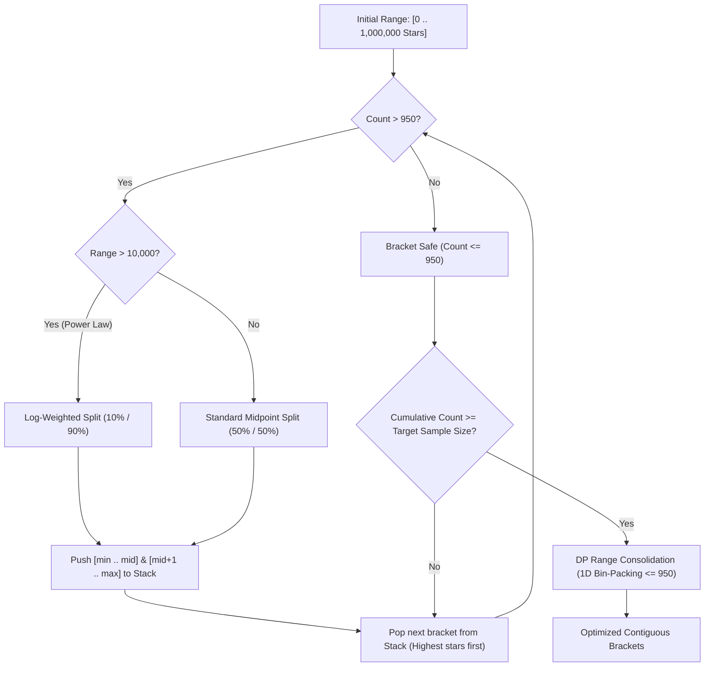
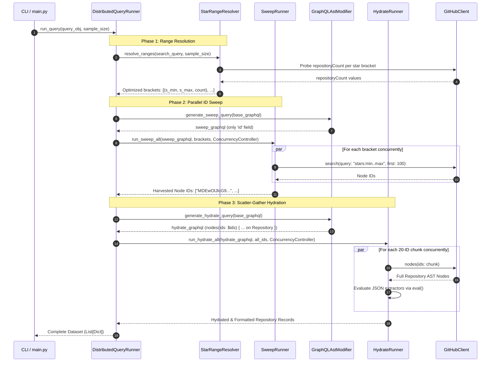
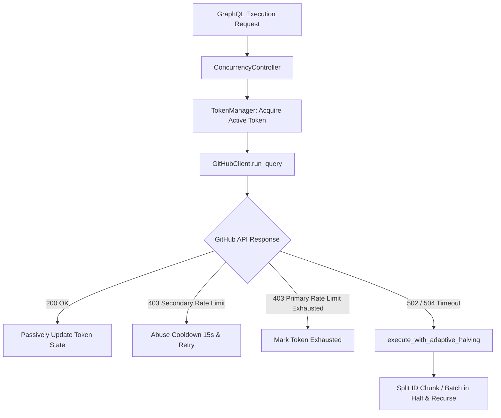

# GitHub API Extraction Pipeline & 1k Limit Bypass

This document describes the architectural design and implementation details of the data extraction pipeline used in Lab 01. It explains how the system bypasses the GitHub API 1,000-search-result limitation and how the distributed 3-phase pipeline (`Resolution` $\rightarrow$ `Sweep` $\rightarrow$ `Hydration`) reliably extracts high-volume repository metrics.

---

## 1. The 1,000-Result Search Limit Problem

GitHub's Search API (both REST `/search/repositories` and GraphQL `search(...)` connections) enforces a strict ceiling: **only the first 1,000 search results are accessible for any given query**, regardless of cursor pagination (`first: 100`, `after: cursor`). Attempting to paginate beyond the 1,000th item causes the API to return empty nodes or errors.

For research questions requiring analysis of top repositories or samples exceeding 1,000 repositories, a naive linear search cannot extract the complete dataset.

---

## 2. Bypassing the Limit: Dynamic Star-Range Sharding

To bypass the 1,000-item barrier while maintaining global ordering by star count, the extraction engine implements **Dynamic Star-Range Sharding with Power-Law Adaptive Bisection and DP Consolidation** in [`StarRangeResolver`](file:///home/jao/facul/Experimentação/laboratorio-experimentacao-de-software/lab01/src/engine/star_range_resolver.py#L10-L150).



### 2.1. Probing Repository Counts
Instead of pulling full payloads, [`StarRangeResolver._get_count`](file:///home/jao/facul/Experimentação/laboratorio-experimentacao-de-software/lab01/src/engine/star_range_resolver.py#L16-L43) queries only the metadata count for a bracket:

```graphql
query($searchQuery: String!) {
  search(query: $searchQuery, type: REPOSITORY, first: 1) {
    repositoryCount
  }
}
```

By appending `stars:min..max` qualifiers, the resolver probes how many repositories fall within that window.

### 2.2. Safety Threshold & Skewed Power-Law Bisection
* **Buffer Threshold**: Brackets are capped at `threshold = 950` ([`star_range_resolver.py:L14`](file:///home/jao/facul/Experimentação/laboratorio-experimentacao-de-software/lab01/src/engine/star_range_resolver.py#L14)) to prevent boundary overflow and edge conditions near GitHub's 1,000-item ceiling.
* **Power-Law Split**: Because GitHub repository stars follow a heavy-tailed power-law distribution (very few repos have >50k stars, while millions have 0–100 stars), a standard binary midpoint on large intervals produces unbalanced partitions. For ranges where `max_stars - min_stars > 10000`, the resolver applies a 10/90 log-weighted bisection:
  $$\text{mid} = \text{min\_stars} + \left\lfloor\frac{\text{max\_stars} - \text{min\_stars}}{10}\right\rfloor$$
  For narrower intervals, it falls back to binary search:
  $$\text{mid} = \left\lfloor\frac{\text{min\_stars} + \text{max\_stars}}{2}\right\rfloor$$
* **High-to-Low Stack Traversal**: Brackets with higher stars are processed first. As soon as the cumulative count reaches the requested `sample_size`, stack traversal stops immediately without exploring unnecessary low-star ranges.

### 2.3. Dynamic Programming Range Consolidation
After adaptive bisection, adjacent brackets may contain small counts. To minimize total API calls, [`StarRangeResolver._dp_consolidate`](file:///home/jao/facul/Experimentação/laboratorio-experimentacao-de-software/lab01/src/engine/star_range_resolver.py#L98-L150) runs a dynamic programming 1D bin-packing algorithm over the contiguous brackets:

$$\text{dp}[i] = 1 + \min_{j \in [i, n), \sum_{k=i}^j \text{count}[k] \le 950} \text{dp}[j+1]$$

This compresses multiple small adjacent brackets into the fewest possible queries while guaranteeing that each merged bracket contains $\le 950$ repositories.

---

## 3. Extraction Pipeline Architecture

The extraction pipeline is orchestrated by [`DistributedQueryRunner`](file:///home/jao/facul/Experimentação/laboratorio-experimentacao-de-software/lab01/src/engine/distributed_query_runner.py#L18-L93) through three decoupled phases:



---

## 4. Pipeline Stages in Detail

### Phase 1: Star Range Resolution
* **Class**: [`StarRangeResolver`](file:///home/jao/facul/Experimentação/laboratorio-experimentacao-de-software/lab01/src/engine/star_range_resolver.py#L10-L150)
* **Input**: Search query (e.g., `stars:>1 sort:stars-desc`) and target `sample_size`.
* **Output**: List of non-overlapping, contiguous star brackets $[(min_1, max_1, count_1), \dots]$ ordered descending by star count.

### Phase 2: Lightweight ID Sweep
* **Class**: [`SweepRunner`](file:///home/jao/facul/Experimentação/laboratorio-experimentacao-de-software/lab01/src/engine/sweep_runner.py#L13-L107)
* **Goal**: Collect only the GitHub GraphQL Node IDs (`id`) for each repository in the target brackets.
* **AST Transformation**: Uses [`GraphQLAstModifier.generate_sweep_query`](file:///home/jao/facul/Experimentação/laboratorio-experimentacao-de-software/lab01/src/graphql/graphql_util.py#L33-L42) with [`SweepVisitor`](file:///home/jao/facul/Experimentação/laboratorio-experimentacao-de-software/lab01/src/graphql/graphql_util.py#L11-L20) to strip out all metric fields inside `... on Repository`, leaving only `id`.
* **Batching & Concurrency**: Paginates with `first: 100` per request under `QueryWeight.LIGHT` concurrency (up to 10 parallel queries per active token).
* **Output**: Flat list of globally ordered repository IDs (`["MDEwOlJlcG9zaXRvcnkx...", ...]`).

### Phase 3: Scatter-Gather Hydration
* **Class**: [`HydrateRunner`](file:///home/jao/facul/Experimentação/laboratorio-experimentacao-de-software/lab01/src/engine/hydrate_runner.py#L13-L92)
* **Goal**: Retrieve all deep metric fields (pull requests, issues, releases, stargazers, disk usage, etc.) for every harvested repository ID.
* **AST Transformation**: Uses [`GraphQLAstModifier.generate_hydrate_query`](file:///home/jao/facul/Experimentação/laboratorio-experimentacao-de-software/lab01/src/graphql/graphql_util.py#L43-L73) with [`ExtractRepositoryVisitor`](file:///home/jao/facul/Experimentação/laboratorio-experimentacao-de-software/lab01/src/graphql/graphql_util.py#L22-L30) to generate a root-level `nodes(ids: [ID!]!)` query containing the full `... on Repository` fragment.
* **Chunking**: Slices the ID list into chunks of 20 (`CHUNK_SIZE = 20`).
* **Order Preservation**: GitHub GraphQL guarantees that `nodes(ids: $ids)` returns nodes in the identical index order as the input array, preserving ranking order without manual sorting.
* **Data Extraction**: For each repository node returned, the runner evaluates Python extraction expressions defined declaratively in the query's companion JSON metadata ([`queries/unified.json`](file:///home/jao/facul/Experimentação/laboratorio-experimentacao-de-software/lab01/queries/unified.json#L7-L28)).

---

## 5. GraphQL AST Manipulation

The extraction system does not maintain separate hardcoded sweep and hydration queries on disk. Instead, it parses the single source-of-truth query file (e.g. [`queries/unified.graphql`](file:///home/jao/facul/Experimentação/laboratorio-experimentacao-de-software/lab01/queries/unified.graphql)) and uses `graphql-core` AST visitors in [`GraphQLAstModifier`](file:///home/jao/facul/Experimentação/laboratorio-experimentacao-de-software/lab01/src/graphql/graphql_util.py#L32-L73):

```
Base Search Query (.graphql)
       |
       +---> SweepVisitor --------------> Lightweight Sweep Query (id only)
       |
       +---> ExtractRepositoryVisitor --> Hydration Query (nodes(ids: $ids) { ... })
```

* **[`SweepVisitor`](file:///home/jao/facul/Experimentação/laboratorio-experimentacao-de-software/lab01/src/graphql/graphql_util.py#L11-L20)**: Replaces the selection set of `... on Repository` inline fragments with `id`.
* **[`ExtractRepositoryVisitor`](file:///home/jao/facul/Experimentação/laboratorio-experimentacao-de-software/lab01/src/graphql/graphql_util.py#L22-L30)**: Extracts the full repository fragment and injects it into a `nodes(ids: $ids)` template alongside rate limit telemetry:

```graphql
query($ids: [ID!]!) {
  rateLimit {
    cost
    remaining
    resetAt
  }
  nodes(ids: $ids) {
    ... on Repository {
      nameWithOwner
      createdAt
      stargazerCount
      forkCount
      # ... all other requested metrics
    }
  }
}
```

---

## 6. Resilience, Concurrency, and Multi-Token Management

To ensure reliable long-running executions across thousands of repositories, the system includes multiple resilience layers:



### 6.1. Multi-Token Pool ([`TokenManager`](file:///home/jao/facul/Experimentação/laboratorio-experimentacao-de-software/lab01/src/core/token_manager.py#L25-L101))
* Manages multiple Personal Access Tokens provided via `.env` (`GITHUB_TOKENS=token1,token2,...`).
* Rotates tokens round-robin across requests.
* Passively updates each token's remaining quota and reset timestamp from the GraphQL `rateLimit` payload in successful responses.
* If all tokens become exhausted, execution automatically enters a global sleep until the earliest token reset time.

### 6.2. Weight-Based Concurrency ([`ConcurrencyController`](file:///home/jao/facul/Experimentação/laboratorio-experimentacao-de-software/lab01/src/core/concurrency_controller.py#L18-L45))
Concurrency is throttled dynamically based on active token count and query computational weight:
$$\text{Max Concurrency} = \max(1, |\text{Active Tokens}| \times \text{Weight})$$

* `QueryWeight.LIGHT = 10` (used for ID sweeping)
* `QueryWeight.MEDIUM = 5`
* `QueryWeight.HEAVY = 3` (used for nested metric hydration)

### 6.3. Adaptive Payload Halving ([`execute_with_adaptive_halving`](file:///home/jao/facul/Experimentação/laboratorio-experimentacao-de-software/lab01/src/core/resilience.py#L53-L106))
Complex nested GraphQL queries on large repositories occasionally trigger HTTP 502/504 Gateway Timeouts from GitHub. When a timeout is detected:
* If the payload is a list of repository IDs, the runner splits the list into two halves and executes both concurrently.
* If the payload is a batch size integer, it scales down the batch size and retries with backoff.

---

## 7. Storage and Execution Interface

### 7.1. CSV Manager ([`CSVManager`](file:///home/jao/facul/Experimentação/laboratorio-experimentacao-de-software/lab01/src/storage/csv_manager.py#L10-L54))
* Outputs data into `lab01/dados/` with dynamic column extraction.
* Supports writing individual research question datasets (`rq01_sample.csv` to `rq06_sample.csv`, `unified_sample.csv`) and merging multi-dataset runs into `all_results.csv` keyed by repository `nameWithOwner`.

### 7.2. CLI Entry Point ([`main.py`](file:///home/jao/facul/Experimentação/laboratorio-experimentacao-de-software/lab01/main.py#L32-L95))
```bash
# Run specific research question extraction
uv run main.py --rq 1

# Run the unified query (all RQs in a single pass)
uv run main.py --rq unified

# Run all individual RQs and merge into all_results.csv
uv run main.py --rq all --merge
```
