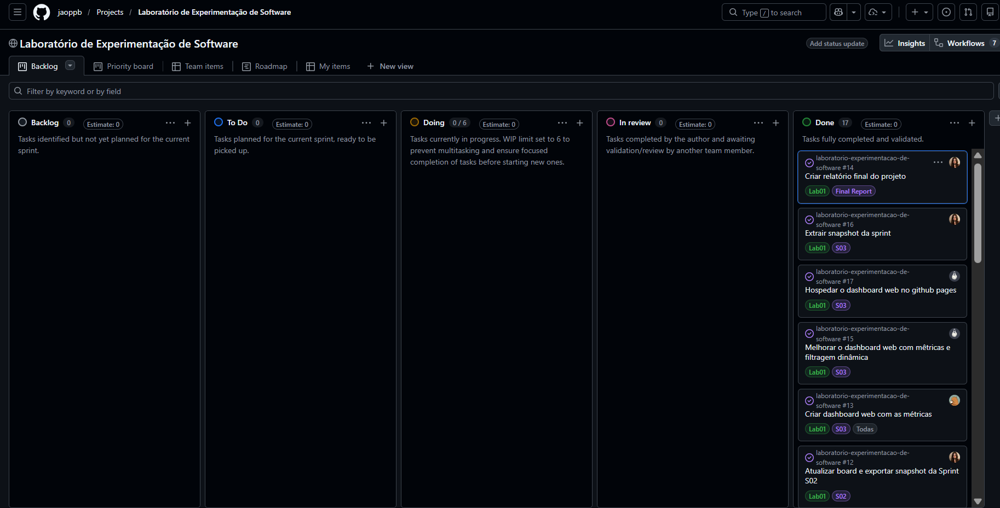

# Laboratório de Experimentação de Software — Relatório

| Campo | Valor |
|---|---|
| **Curso** | Engenharia de Software |
| **Disciplina** | Laboratório de Experimentação de Software |
| **Turno / Período** | Noite / 6º |
| **Professor(a)** | Danilo Maia |
| **Laboratório** | Lab01 — Características de Repositórios Populares + Setup do Kanban |
| **Grupo (trio)** | Marcela Campos (@marcelacamposm) · João Pedro Peres (@jaoppb) · Gabriel Assis (@GabriAssiss)|
| **Link do repositório / GitHub Projects** | https://github.com/jaoppb/laboratorio-experimentacao-de-software · Projects: https://github.com/users/jaoppb/projects/3 |
| **Data de entrega** | 26/08/2026 |

---

## 1. Introdução

Este laboratório investigou características estruturais e de manutenção dos
repositórios open-source mais populares do GitHub, buscando entender se
popularidade está associada a maturidade, contribuição externa, cadência de
entrega, atualização, linguagem de implementação e qualidade da gestão de
issues. Em paralelo, o laboratório deu início ao uso do GitHub Projects (v2)
como quadro Kanban do grupo, processo mantido durante todo o semestre.

**Questões de Pesquisa do enunciado:**
- RQ01 — Sistemas populares são maduros/antigos? (idade do repositório)
- RQ02 — Sistemas populares recebem muita contribuição externa? (PRs aceitas)
- RQ03 — Sistemas populares lançam releases com frequência? (total de releases)
- RQ04 — Sistemas populares são atualizados com frequência? (tempo até última atualização)
- RQ05 — Sistemas populares são escritos nas linguagens mais populares? (linguagem primária)
- RQ06 — Sistemas populares possuem alto percentual de issues fechadas? (razão issues fechadas/total)
- RQ07 — Sistemas em linguagens mais populares recebem mais contribuição, lançam mais releases e são atualizados com mais frequência? (RQ02, RQ03, RQ04 por linguagem)

**Hipóteses informais** (formuladas antes da análise completa dos dados):
- **RQ01** (Marcela): a popularidade de um repositório não está fortemente
  relacionada à sua idade — repositórios populares surgem e se mantêm
  populares em diferentes momentos, não só os mais antigos.
- **RQ02** (Marcela): a contribuição externa entre repositórios populares é
  distribuída de forma desigual — uma minoria (frameworks e bibliotecas
  amplamente utilizadas) concentra a maior parte das contribuições aceitas.
- **RQ03** (João): repositórios populares e com ciclo de desenvolvimento
  maduro tendem a adotar entregas frequentes, resultando em um volume
  expressivo de releases acumuladas.
- **RQ04** (João): repositórios com grande base de usuários e colaboradores
  recebem manutenção ativa constante, portanto a maioria expressiva possui
  atualizações muito recentes.
- **RQ05** (Gabriel): a distribuição de popularidade continua concentrada em
  algumas linguagens dominantes — Python, JavaScript e TypeScript devem
  liderar com folga —, mas deve existir uma fração relevante de repositórios
  sem linguagem bem definida.
- **RQ06** (Gabriel): a maioria dos repositórios populares fecha uma fração
  substancial das suas issues, indicando manutenção ativa na maior parte dos
  projetos.

Além do enunciado, o grupo propôs como contribuição adicional: **(i)** um dashboard interativo publicado na web, com filtros
multidimensionais e inspeção de repositório individual; **(ii)** uma matriz
de correlação de Spearman entre as seis métricas numéricas, ampliando o
escopo da RQ07; **(iii)** processamento da base completa de repositórios
(99.984, não apenas a amostra mínima de 1.000) para as visualizações do
dashboard. Detalhes na seção 3.6.

[Dashboard Interativo](https://jaoppb.github.io/laboratorio-experimentacao-de-software/lab01/)

---

## 2. Contexto

Este é o Lab01 da disciplina, primeiro de uma sequência de 5 laboratórios
que compartilham o mesmo repositório e o mesmo GitHub Projects (v2), criado
e configurado nesta etapa para ser reutilizado até o final do semestre.

O objeto de estudo são os repositórios mais populares do GitHub, medidos
pelo número de estrelas. O enunciado solicitava a coleta de dados para os
1.000 repositórios com maior número de estrelas; o grupo ampliou a coleta
bruta para **99.984 repositórios** (ver seção 4.1), mantendo a amostra de
1.000 para as validações estatísticas exigidas na Sprint S02, conforme o
escopo definido pelo enunciado.

A fonte de referência usada para "linguagens mais populares" (RQ05) é o
**GitHub Octoverse**, o relatório anual do próprio GitHub sobre o uso de
linguagens de programação na plataforma — escolhido por manter coerência
com a origem dos demais dados do laboratório (a própria API do GitHub).

---

## 3. Metodologia

### 3.1 Principais Desafios

- **Rate limit e instabilidade da API GraphQL do GitHub:** com dezenas de
  milhares de repositórios a consultar, o grupo implementou três camadas de
  resiliência: **(i)** um pool de múltiplos tokens de acesso pessoal
  (rotação round-robin via `.env`), que entra em espera automática apenas
  quando todos os tokens se esgotam simultaneamente; **(ii)** controle de
  concorrência baseado no peso computacional de cada tipo de consulta
  (buscas leves de ID toleram até 10 requisições simultâneas por token
  ativo, consultas pesadas de hidratação de métricas até 3); **(iii)**
  divisão adaptativa de lotes (*adaptive halving*) quando a API retorna
  erro de timeout (502/504) — o lote de IDs em processamento é dividido ao
  meio e reprocessado em paralelo, reduzindo o tamanho até a requisição ter
  sucesso.
- **Limite de 1.000 resultados da GitHub Search API:** tanto a Search API
  REST quanto a busca via GraphQL retornam, no máximo, os primeiros 1.000
  resultados de qualquer consulta, independentemente da paginação usada — é
  um teto rígido da própria API. O grupo (João) contornou essa limitação com
  um pipeline de extração em três fases:
  1. **Resolução de faixas (`StarRangeResolver`):** o intervalo de estrelas
     (0 a 1.000.000) é sondado recursivamente, consultando apenas a
     contagem (`repositoryCount`) de cada faixa candidata, sem baixar dados
     completos. Como o número de estrelas segue uma distribuição de cauda
     longa (poucos repositórios com dezenas de milhares de estrelas, e
     milhões com poucas), a divisão de cada faixa usa uma bisecção
     adaptativa: faixas amplas (>10.000 de intervalo) são divididas de
     forma assimétrica (10%/90%), e faixas mais estreitas usam bisecção
     tradicional (50%/50%). Cada faixa final é limitada a no máximo 950
     repositórios (margem de segurança abaixo do teto de 1.000), e um
     algoritmo de programação dinâmica (*bin-packing* 1D) consolida faixas
     adjacentes pequenas para minimizar o número total de consultas.
  2. **Varredura leve de IDs (`SweepRunner`):** para cada faixa resolvida,
     uma busca é feita solicitando apenas o campo `id` de cada repositório
     (via manipulação da árvore sintática/AST da query GraphQL, removendo
     os demais campos), reduzindo o custo de cada consulta.
  3. **Hidratação em lote (`HydrateRunner`):** os IDs coletados são
     agrupados em lotes de 20 e usados para buscar todos os campos
     completos via `nodes(ids: [ID!]!)`, que preserva a ordem original dos
     IDs enviados — evitando reordenação manual dos resultados.
  Esse pipeline conta ainda com gerenciamento de múltiplos tokens
  (rotação round-robin, pausa automática quando todos se esgotam),
  concorrência ajustada pelo peso computacional de cada tipo de consulta, e
  divisão adaptativa de lotes em caso de timeout (502/504).
- Ausência de histórico de mudança de status consultável via API no GitHub
  Projects — resolvido com script próprio de snapshot (`board-snapshots/`),
  executado a cada sprint/aula.

### 3.2 Tomadas de Decisão

- **Limite de WIP** da coluna Doing definido em 6 cartões (2 por integrante
  ativo em um trio), para reduzir multitasking e forçar o fechamento de
  tarefas antes do início de novas.
- **Ferramenta de visualização — Power BI vs. dashboard web:** o grupo
  cogitou inicialmente usar Power BI para a análise e visualização (Sprint
  S03), mas a complexidade de configuração (conexão com os dados,
  hospedagem/compartilhamento do relatório) tornou essa opção pouco viável
  no prazo disponível. A alternativa adotada foi um dashboard web em
  React + TypeScript, publicado via GitHub Pages, que também permitiu maior
  liberdade para interatividade (filtros multidimensionais, inspeção
  individual de repositório).
- **Formato de dados para o dashboard:** para processar quase 100 mil
  repositórios ao vivo no navegador, os dados são servidos em formato
  **Parquet** (`unified_sample.parquet`), lido via **WebAssembly (WASM)**
  dentro de um Web Worker — essa combinação foi escolhida por desempenho:
  Parquet é um formato colunar compacto, e o WASM permite processar/agregar
  os dados no navegador em velocidade próxima à nativa, sem travar a
  interface.
- Validação estatística realizada sobre amostra aleatória de 1.000
  repositórios (seed fixa = 42, para reprodutibilidade), extraída da base
  completa, mantendo o escopo do enunciado (S02) mesmo com a base bruta
  maior.
- Adoção de testes automatizados (`pytest`) como forma de validação de
  dados (valores ausentes, distribuição, outliers via IQR), priorizando
  reprodutibilidade e evidência auditável em vez de inspeção manual.

### 3.3 Etapas

| Sprint | Entregas | Responsável(is) | Issues (nº) |
|---|---|---|---|
| S01 | Consulta GraphQL (100 repositórios) por RQ + GitHub Projects criado (colunas, WIP, campos customizados) | Marcela (RQ01+RQ02); Gabriel (RQ05+RQ06); João (RQ03+RQ04 e integração) | #2, #3, #4, #5 |
| S02 | Paginação/otimização para base completa; validação estatística (testes automatizados) em amostra de 1.000; hipóteses informais; snapshot do board; script de geração automática dos resultados | João (paginação/otimização); Marcela (validação RQ01+RQ02, script de geração de resultados); Gabriel (validação RQ05+RQ06); João (validação RQ03+RQ04); Marcela (consolidação) | #6, #11, #12, [confirmar demais] |
| S03 | Dashboard interativo (React/TypeScript, Parquet+WASM) com as 7 RQs, matriz de correlação, benchmark por repositório; publicação via GitHub Pages; relatório final; snapshot | Gabriel (dashboard inicial); João (migração para React/TypeScript, melhorias e publicação); Marcela (relatório final e snapshot) | #13, #14, #15, #16, #17 |

**Configuração do processo:** o GitHub Projects (v2) do grupo utiliza as
colunas Backlog → To Do → Doing → Review → Done, com limite de WIP de 6
cartões na coluna Doing (justificativa na seção 3.2), e campos customizados
Lab, Sprint e RQ para organizar as Issues ao longo dos cinco laboratórios do
semestre.

### 3.4 Ferramentas

- API GraphQL do GitHub, consumida por script próprio do grupo (sem
  bibliotecas de terceiros de acesso à API).
- Python (extração e validação); `pandas` (manipulação e estatística);
  `pytest` (testes automatizados de validação); `structlog` (logging
  estruturado do processo de extração); `graphql-core` (manipulação da
  árvore sintática/AST das queries GraphQL, usada para gerar
  automaticamente as versões "sweep" e "hydrate" a partir de uma única
  query-fonte); `asyncio` (execução concorrente das fases de varredura e
  hidratação).
- React + TypeScript (dashboard interativo); **Apache Parquet**
  (`unified_sample.parquet`) como formato de dados consumido pelo
  dashboard; **WebAssembly (WASM)** + Web Worker para processamento
  performático no navegador.
- GitHub Actions (`deploy-pages.yml`) e GitHub Pages para publicação
  automática do dashboard a cada push na `main`.
- GitHub Projects (v2) como ferramenta de processo — board:
  https://github.com/users/jaoppb/projects/3.

### 3.5 Tabela de Métricas

| RQ | Métrica | Definição Operacional | Unidade | Ferramenta / Fonte |
|---|---|---|---|---|
| RQ01 | Idade do repositório | Data atual − data de criação (`createdAt`) | Dias | Script GraphQL próprio (API GitHub) |
| RQ02 | Pull requests aceitas | Contagem de PRs com `states: [MERGED]` | Nº absoluto | Script GraphQL próprio (API GitHub) |
| RQ03 | Total de releases | Contagem total de releases cadastradas | Nº absoluto | Script GraphQL próprio (API GitHub) |
| RQ04 | Tempo até última atualização | Data atual − data do último push (`updatedAt`) | Dias | Script GraphQL próprio (API GitHub) |
| RQ05 | Linguagem primária | Campo `primaryLanguage` do repositório | Categórica | Script GraphQL próprio; fonte de referência: GitHub Octoverse |
| RQ06 | Razão de issues fechadas | issues fechadas ÷ total de issues | Proporção (0–1) | Script GraphQL próprio (API GitHub) |
| RQ07 | Cruzamento RQ02/03/04 por linguagem | Mediana de PRs, releases e dias s/ update, agrupada por `primaryLanguage` | Nº absoluto / dias | Cálculo derivado (dashboard, Web Worker) |

### 3.6 Inovações Propostas pelo Grupo (30% da nota)

- **Dashboard interativo publicado na web** (não exigido pelo enunciado, que
  pede apenas "análise e visualização"): filtragem multidimensional (idade,
  PRs, releases, linguagem, recência, taxa de fechamento), inspeção de
  qualquer repositório individual com comparação percentual contra a
  mediana global, e radar multidimensional de posicionamento — processando
  quase 100 mil repositórios ao vivo no navegador via Parquet + WebAssembly.
- **Matriz de correlação de Spearman** entre as seis métricas numéricas,
  ampliando a RQ07 além do que o enunciado pedia (medianas por linguagem),
  incluindo força e sinal da relação entre cada par de métricas.
- **Processamento da base completa** (~99.984 repositórios) para as
  visualizações do dashboard, em vez de restringir a análise a 1.000,
  permitindo maior granularidade nos percentis (ex.: P99) reportados.
- **Script de geração automática dos resultados** (`gerar_resultados.py`),
  que recalcula todas as estatísticas de RQ01 a RQ07 diretamente do CSV
  consolidado, tornando o relatório reprodutível em vez de depender de
  números copiados manualmente.
- **Pipeline de extração em três fases** (Resolução → Varredura →
  Hidratação), com bisecção adaptativa por faixas de estrelas e
  consolidação via programação dinâmica: vai além do mínimo exigido pelo
  enunciado (que pede apenas um "script próprio" de consulta GraphQL),
  otimizando o número de chamadas à API e permitindo escalar a coleta para
  quase 100 mil repositórios sem esbarrar no teto de 1.000 resultados por
  busca.

O impacto dessas inovações nos resultados é discutido na seção 4.3.

---

## 4. Resultados

### 4.1 Coleta de Dados

A extração via GraphQL coletou **99.984 repositórios** (aproximadamente 100
mil), superando o volume mínimo de 1.000 exigido pelo enunciado. Todos os
campos necessários às 7 RQs foram obtidos para a totalidade da base.

Para a validação estatística exigida na Sprint S02, foi extraída uma amostra
aleatória de 1.000 repositórios da base completa (seed fixa = 42), conforme
o escopo do enunciado. Os colegas João e Gabriel, por sua vez, recalcularam
as estatísticas de suas RQs sobre a **base completa** (99.984), obtendo
medidas mais representativas que a amostra mínima.

- Valores ausentes em `primary_language` (RQ05): 8.180 de 99.984 (≈8,18%)
- Valores ausentes em `closed_issues_ratio` (RQ06): 4.831 de 99.984 (≈4,83%),
  tipicamente repositórios com `total_issues == 0` (razão indefinida)
- Nenhum valor ausente identificado em RQ01/RQ02 na amostra de validação de
  1.000 repositórios; 157 outliers (15,7%) identificados em RQ02 pelo método IQR
- Nenhum outlier identificado em RQ06 pelo método IQR na base completa
  (limites calculados: [-0,0799; 1,5085])

### 4.2 Visualização Gráfica

**RQ01 — Sistemas populares são maduros/antigos?**
Mediana de 8,1 anos (média 7,9 anos; máximo 18,8 anos). Distribuição
concentrada entre 6 e 12 anos, com cauda decrescente até ~19 anos.

**RQ02 — Sistemas populares recebem muita contribuição externa?**
Mediana de 27 PRs mescladas; P90 = 638; P99 = 6.047; média de 389. Curva de
quantis fortemente assimétrica.

**RQ03 — Sistemas populares lançam releases com frequência?**
45,3% dos repositórios não possuem nenhuma release cadastrada. Entre a base
completa: mediana geral de 2 releases, média de 28,58 (desvio padrão 87,11),
variando de 0 a 1.000 releases.

**RQ04 — Sistemas populares são atualizados com frequência?**
Mediana de 2 dias desde a última atualização (média de 9,25 dias, desvio
padrão 20,48, variando de 0 a 773 dias). A maior parte dos repositórios
populares foi atualizada na última semana.

**RQ05 — Sistemas populares são escritos nas linguagens mais populares?**
Top 10 linguagens (base completa, n=99.984): Python (18.089), JavaScript
(11.858), TypeScript (9.083), Java (6.021), Go (5.750), C++ (5.306), C
(3.927), Rust (3.307), C# (2.975), Shell (2.495). 8,18% dos repositórios não
têm linguagem primária identificada.

**RQ06 — Sistemas populares possuem alto percentual de issues fechadas?**
Base completa (95.153 observações não nulas): mediana de 0,750, média de
0,689, desvio padrão de 0,265, variando de 0 a 1. Sem outliers pelo método
IQR.

**RQ07 — Sistemas em linguagens populares recebem mais contribuição,
releases e atualização?**
Rust apresenta a maior mediana de PRs mescladas entre as 12 linguagens de
maior volume (~140), seguido por TypeScript (~93) e Go (~80). A mediana de
dias sem atualização é baixa e homogênea entre linguagens.

**Matriz de correlação (Spearman, ρ, inovação do grupo):** correlação forte
entre PRs mescladas e total de issues (ρ = +0,70); correlação
moderada/forte entre PRs mescladas e releases (ρ = +0,59); correlações
fracas e majoritariamente negativas entre dias sem atualização e as demais
métricas (ρ entre −0,04 e −0,15).

*[inserir aqui as capturas de tela dos gráficos do dashboard correspondentes
a cada RQ acima]*

### 4.3 Discussão

**RQ01:** hipótese parcialmente confirmada — a mediana de 8,1 anos indica
repositórios de fato consolidados, mas a ausência de outliers e a
distribuição relativamente homogênea sugerem que popularidade não exige
décadas de existência.

**RQ02:** hipótese confirmada — contribuição externa significativa, porém
extremamente desigual (mediana de 27 PRs contra P99 de 6.047).

**RQ03:** hipótese parcialmente refutada — embora exista um grupo de
repositórios com uso intenso de releases (média de 28,58, puxada por
outliers de até 1.000 releases), a mediana geral de apenas 2 releases e o
fato de 45,3% não terem nenhuma release contradizem a expectativa de que a
maioria dos projetos populares adota entregas formais e frequentes.

**RQ04:** hipótese confirmada — mediana de apenas 2 dias sem atualização
indica manutenção muito ativa na maioria dos repositórios populares,
embora o desvio padrão (20,48 dias) e o máximo de 773 dias mostrem que uma
minoria está de fato abandonada ou em manutenção esporádica.

**RQ05:** hipótese confirmada — Python, JavaScript e TypeScript lideram com
folga, concentrando boa parte da base. A fração de 8,18% sem linguagem
identificada é relevante e foi tratada como categoria à parte nas análises.

**RQ06:** hipótese confirmada — mediana de 0,75 na base completa indica que
a maioria dos projetos populares mantém boa parte das issues fechadas,
embora o desvio padrão de 0,265 mostre variação relevante entre ecossistemas
e tipos de projeto.

**RQ07:** os dados sugerem que a linguagem de implementação está associada
a diferenças relevantes no volume de contribuição externa (Rust, TypeScript
e Go se destacam), mas não à recência de atualização, que se mantém
homogênea entre linguagens.

**Ameaças à validade:** a definição de "repositório popular" restrita a
número de estrelas pode favorecer listas curadas de conteúdo (coletâneas de
recursos) em detrimento de projetos de software tradicionais, o que pode
distorcer RQ03 e RQ05. A coleta foi feita em um único ponto no tempo, sem
capturar sazonalidade de contribuição.

**Contribuição das inovações (seção 3.6):** o dashboard interativo e a
matriz de correlação permitiram identificar que a força da associação entre
contribuição externa, releases e issues é consistente e forte, enquanto a
atividade recente (RQ04) é praticamente independente das demais métricas —
uma nuance que não seria visível apenas com as medianas isoladas por RQ.

---

## 5. Conclusão

Os resultados indicam que repositórios populares no GitHub são, em geral,
maduros (mediana de 8 anos), recebem contribuição externa significativa mas
desigual, adotam de forma parcial (54,7%) o recurso oficial de releases, são
mantidos ativamente (mediana de 2 dias sem atualização) e concentram boa
parte de sua base em poucas linguagens, com Python à frente. A taxa de
resolução de issues é tipicamente alta (mediana de 75%), sugerindo
comunidades ativas na triagem de problemas.

---

## 6. Referências

- ZUSE, Horst. *A framework of software measurement*. Walter de Gruyter, 2013.
- GitHub Octoverse — relatório anual de linguagens de programação no GitHub. https://octoverse.github.com/
- Documentação da API GraphQL do GitHub. https://docs.github.com/en/graphql